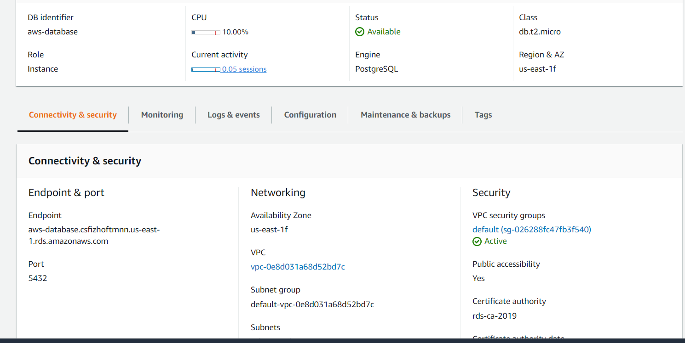
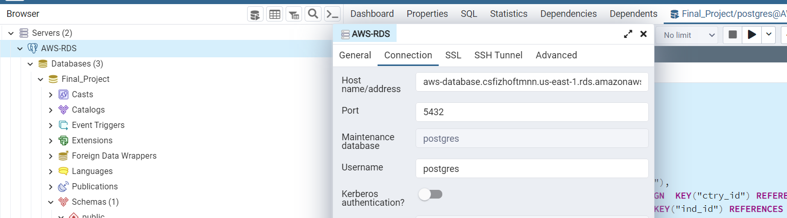

### AWS RDS creation
    

  
  
  

  

  

  
### Draft ERD
    
     
   
   

### Table creation scripts(Draft)

     Documents that have attributes information and table scripts:
     QuickDBD-Final-Project.pdf
     Postgres_sql_scripts.txt

## New concepts learned while working on the project
    Came across some new concepts that were tried during the project and listed them in document listed below.
    Dicument name - New_concepts_learned.docx

